# PupperCoin Crowdsale Launch 

## Background

Along with with a group of Ethereum BlockChain enthusiasts I decided to launch PupperCoin, a Fungible Token based on Ehereum and launch crowdsale of our token in order to help fund the network development. This network will be used to track the dog breeding activity across the globe in a decentralized way, and allow humans to track the genetic trail of their pets. We already worked with the necessary legal bodies and have the green light on creating a crowdsale open to the public. However, we are required to enable refunds if the crowdsale is successful and the goal is met, and  are only allowed to raise a maximum of 300 Ether. The crowdsale will run for 24 weeks.

In order for us to lanch the Crowdsale, we will need to create an ERC20 token that will be minted through a `Crowdsale` contract that can be leveraged from the OpenZeppelin Solidity library. The Crowdsale contract will inherit `Crowdsale`, `CappedCrowdsale`, `TimedCrowdsale`, `RefundableCrowdsale`, and `MintedCrowdsale` libraries from OpenZeppelin, enabling it to manage manage the entire process, allowing users to send ETH and get back PUP (PupperCoin) and mint the tokens automatically and distribute them to buyers in one transaction. 

Finally we will conduct the crowdsale on the Kovan or Ropsten testnet in order to get a real-world pre-production test in.

## Designing the contracts

### ERC20 PupperCoin

[PupperCoin](PupperCoin.sol) simply inherits the  standard `ERC20Mintable` and `ERC20Detailed` contracts, by taking the  the `decimals` parameter which is hardcoded to `18` in our solidity program.

This contract initiates ERC20Mintable contract by passing the Name, Symbol and decimals parameters/

### PupperCoinCrowdsale

[PupperCoinCrowdsale](PupperCoinCrowdSale.sol) inherits the following OpenZeppelin contracts:

* `Crowdsale`

* `MintedCrowdsale`

* `CappedCrowdsale`

* `TimedCrowdsale`

* `RefundablePostDeliveryCrowdsale`

The parameters for all of the features of our crowdsale, such as the `name`, `symbol`, `wallet` for fundraising, `goal`, Cap, rate, etc. are defined in the PupperCoinSaleDeployer contract which instantiates PupperCoinCrowdSale and PupperCoin contracts by passing these parameters at the deployment time. 

Since `RefundablePostDeliveryCrowdsale` inherits the `RefundableCrowdsale` contract, which requires a `goal` parameter, we must call the `RefundableCrowdsale` constructor from  `PupperCoinCrowdsale` constructor as well as the others. `RefundablePostDeliveryCrowdsale` does not have its own constructor, so we will just use the `RefundableCrowdsale` constructor that it inherits.

If you forget to call the `RefundableCrowdsale` constructor, the `RefundablePostDeliveryCrowdsale` will fail since it relies on it (it inherits from `RefundableCrowdsale`), and does not have its own constructor.

When passing the `open` and `close` times, we will use `now` and `now + 1 hours` to set the times properly in our `PupperCoinCrowdsaleDeployer` contract.

### PupperCoinCrowdsaleDeployer

In this contract, The parameters for all of the features of our crowdsale, such as the `name`, `symbol`, `wallet` for fundraising, `goal`, Cap, rate, etc. are defined in the PupperCoinSaleDeployer contract which instantiates PupperCoinCrowdSale and PupperCoin contracts by passing these parameters at the deployment time. 

### Deploying the Crowdsale

We will Deploy the crowdsale using Ganache wallet and our local testnet on MetaMask. We can then redeploy it to Kovan or Ropsten testnet, by switching MetaMask to Ropsten or Kovan testnets. When deploying to a network that we don't have control over, faucets will not likely give out 300 test Ether. we can simply reduce the goal when deploying to a testnet to an amount much smaller, like 10,000 wei.

<table> <tr> <td>

- Contracts Deployment
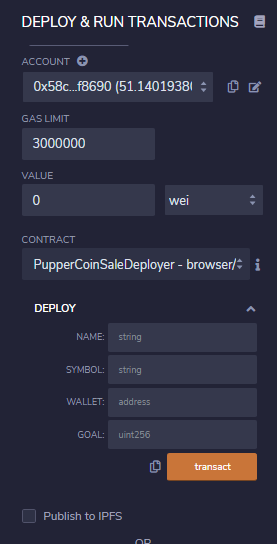 </td> <td>

- PupperCoin Contract Addresses
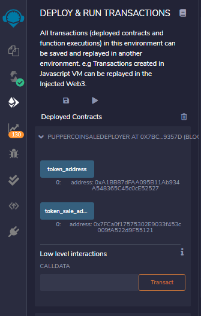 </td> </tr>

 <tr> <td>

PupperCoin Sale Contract
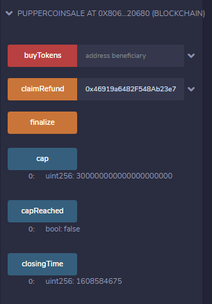 </td> <td>

- PupperCoin Contract 
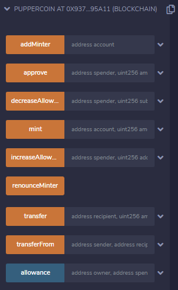 </td> </tr></table>

### Running the Crowdsale and raising funds

We will run crowdsale by sending Ether to the crowdsale from a different accounts (**not** the same account or the Wallet that is raising funds), using MetaMask and then using MyCrypto as well as directly from the Contract. 
We set the fund raising Goal to 200 Ethers with a CAP of 300 Ethers. This means for the fundraiser to be successfull we need to at a minimum raise 200 Ethers but cannot exceed 300 Ethers as recommended by our legal department and we have a limited time window to raise this fund which is set to expire in 24 weeks. for testing purposes we run this for 1 hour by settig the `close` time to be `now + 1 hours`. In the event the Goal is not reached, the contracct has to refund the raised Ether to the donators. the refund feature of `RefundablePostDeliveryCrowdsale` only allows for refunds once the crowdsale is closed **and** the goal is met.

Once we hit the `goal` and the Closing time, We will `finalize` the sale using the `Crowdsale`'s `finalize` function. In order to finalize, `isOpen` must return false (`isOpen` comes from `TimedCrowdsale` which checks to see if the `close` time has passed yet).

<table><tr> <td>

- Raise Funds Via MyCrypto
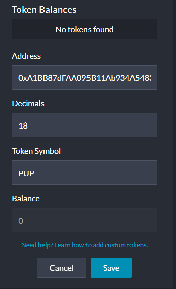 </td> <td>

- Send Ether to PupperCoin Sale Contract 
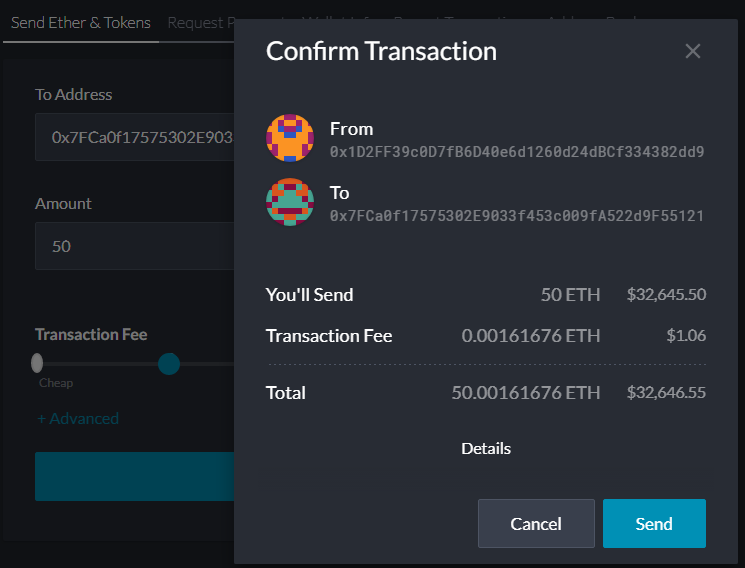 </td> <td>

- Token Balance in MyCrypto wallet 
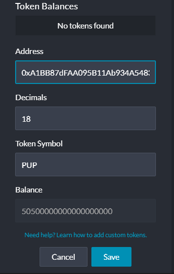 </td> </tr>

<tr><td>
Transact Via MetaMask

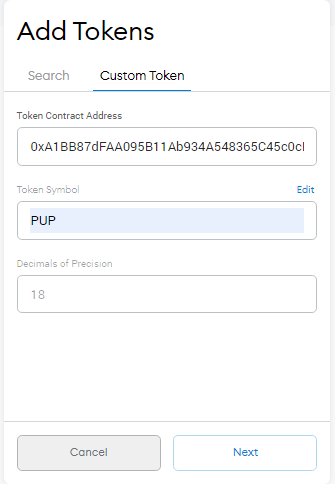 </td> <td>

- Send Ether to PupperCoin Sale Contract 
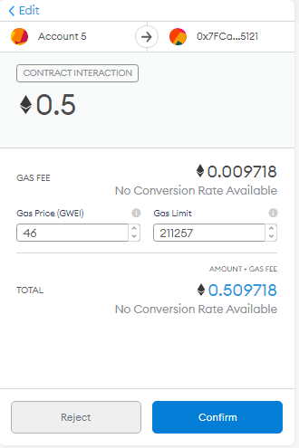 

</td> <td>
- Token Balance in MetaMask

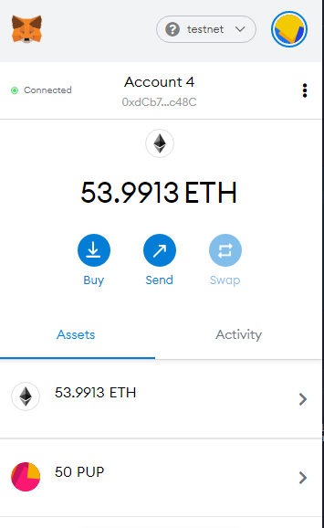
</td> </tr>

<tr><td>
- Fund Raised

 </td> <td>

- Goal & Cap Reached

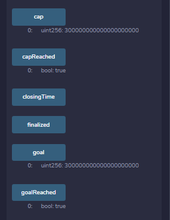 

</td> <td>
- Sale Closed

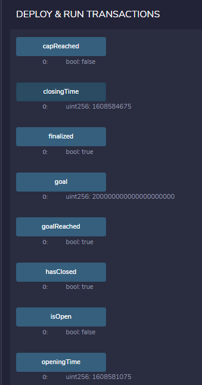
</td> </tr>

<tr><td>
- Contract Finalized & Funds transferred to Wallet

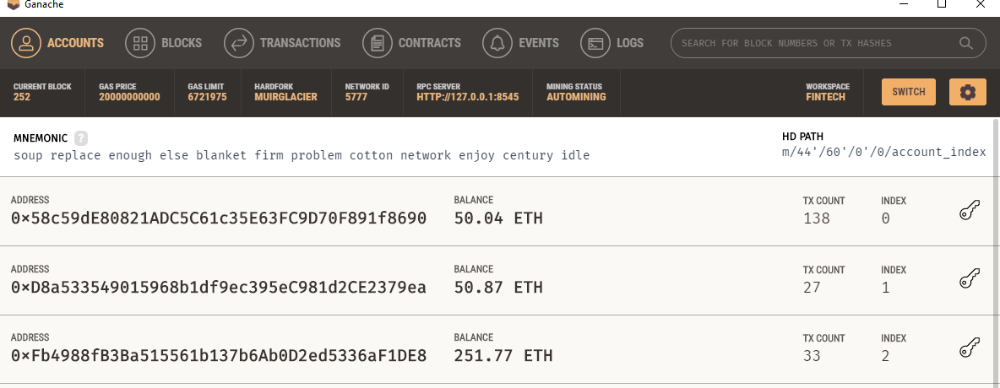 </td> <td>

</td> </tr>
</table>